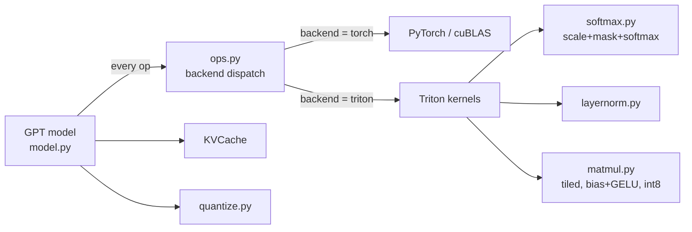

# KernelForge

[](https://github.com/Vanshika-Sharm4/kernelforge/actions)

**LLM inference bring-up and GPU kernel optimization.** KernelForge implements GPT-2 from scratch in PyTorch,
validates it against the Hugging Face reference, then replaces its hot operations with hand-written
[Triton](https://github.com/triton-lang/triton) kernels. It includes a benchmark suite, roofline analysis, and
profiling workflow, and reports honestly where each optimization pays off and where it does not.

The project is organised around the loop performance engineers actually run:

> **bring up** a model → **verify** numerics → **profile** → find the **bottleneck** → write a **kernel** →
> **benchmark** against a strong baseline → explain the result with a **roofline** model.

## What's inside

| Area | What it does |
|---|---|
| **Model bring-up** | GPT-2 (124M) written from scratch, with a static KV cache. Loads Hugging Face weights; logits are checked against the reference. |
| **Fused softmax** | One Triton kernel does scale + causal mask + softmax in a single pass over the attention scores (works with the KV cache, where `T_q < T_k`). |
| **Fused LayerNorm** | Single-pass mean/variance/normalize/affine in float32 accumulation. |
| **Tiled matmul** | Triton GEMM with tiling, grouped program ordering for L2 reuse, autotuning, and a fused bias + GELU epilogue. *Currently slower than cuBLAS on a T4; see Results.* |
| **int8 weights (W8A16)** | Per-channel symmetric quantization and a matmul that dequantizes in registers, designed to cut weight traffic. *Not yet faster than fp16 on a T4; see Results.* |
| **KV cache** | Prefill/decode split; compared against full recomputation. |
| **Benchmarks** | Kernel micro-benchmarks vs PyTorch/cuBLAS, end-to-end tokens/s, roofline plot, `torch.profiler` traces. |
| **Tests** | Every kernel checked against a PyTorch reference; KV-cache and backend equivalence; HF parity. |

## Architecture



Swapping backends is one line (`ops.set_backend("triton")`), so the same model code is the baseline *and* the optimized
version, and tests can assert they agree.

## Repository layout

```
kernelforge/
  model.py            GPT-2 from scratch, KV cache, HF weight loader, int8 conversion
  ops.py              backend dispatch (torch | triton)
  generate.py         greedy generation (with / without cache) + CLI
  quantize.py         per-channel int8 quantization
  kernels/
    softmax.py        fused scale + causal mask + softmax
    layernorm.py      fused LayerNorm
    matmul.py         tiled matmul, fused bias/GELU epilogue, int8 weights
benchmarks/
  bench_kernels.py    kernel micro-benchmarks vs PyTorch
  bench_model.py      end-to-end tokens/s (backend x batch x cache x int8)
  roofline.py         roofline plot
  profile_model.py    torch.profiler trace
  make_report.py      writes docs/RESULTS.md from the CSVs
  run_all.py          runs everything
tests/                kernel, model and HF-parity tests
docs/
  DESIGN.md           design notes and performance analysis
  INTERVIEW_PREP.md   how to explain this project
  RESULTS.md          full measured tables (generated by the benchmarks)
results/colab-t4/     raw CSVs and plots from the T4 run
```

## Quickstart

### On a free GPU (Google Colab or Kaggle, T4)

```bash
!git clone https://github.com/Vanshika-Sharm4/kernelforge.git
%cd kernelforge
!pip install -q -r requirements.txt
!pytest -q                      # correctness on the GPU
!pytest -q -m hf                # parity with Hugging Face GPT-2 (downloads weights)
!python -m kernelforge.generate --prompt "The key to fast LLM inference is" --backend triton
!python -m benchmarks.run_all --tag colab-t4
```

`run_all` writes CSVs, PNG plots and `docs/RESULTS.md` under `results/colab-t4/`. If it is slow, run the pieces
separately: `bench_kernels`, then `bench_model --new-tokens 64`, then `roofline`, then `make_report`.

### On a machine without a GPU

The Triton kernels can be emulated on the CPU for correctness testing (slow, small shapes only):

```bash
pip install -r requirements.txt
TRITON_INTERPRET=1 pytest -q    # 32 tests; model tests run on the PyTorch backend even without TRITON_INTERPRET
```

Performance numbers require a real GPU.

## Usage

```python
import torch
from kernelforge import ops
from kernelforge.model import from_pretrained_gpt2
from kernelforge.generate import generate

ops.set_backend("triton")                                   # or "torch"
model = from_pretrained_gpt2("gpt2", device="cuda", dtype=torch.float16)
model.quantize_int8()                                       # optional: int8 weights for the block linears
out = generate(model, torch.tensor([[464, 3704]], device="cuda"), max_new_tokens=32, use_cache=True)
```

## Results

**Setup:** Tesla T4 (compute capability 7.5, Google Colab), PyTorch 2.11.0+cu130, Triton 3.6.0, CUDA 13.0, fp16.
Kernel timings are medians from `triton.testing.do_bench`. End-to-end runs use a 128-token prompt, 64 new tokens, greedy
decoding, median of 3 repetitions. Speedup is KernelForge (Triton) divided by the PyTorch baseline, so **below 1.0x
means KernelForge is slower**. Full tables are in [`docs/RESULTS.md`](docs/RESULTS.md); raw data and plots are in
`results/colab-t4/`.

### Summary

* **Win: fused scale + causal mask + softmax is 1.9x to 4.4x faster** than the eager PyTorch version (4.3x at T=1024).
* **Parity to modest win: LayerNorm and row softmax** are about 1.0x to 1.45x on large rows, but row softmax is *slower*
  on short rows (0.31x at N=128).
* **Loss: the tiled Triton matmul is 5% to 12% of cuBLAS speed** on large shapes (about 1.5 TFLOPS vs 24 to 37).
  This also drags down the fused bias + GELU matmul and the end-to-end Triton numbers.
* **Loss: int8 weights are about 0.4x to 0.5x the speed** of the fp16-weight Triton kernel, not faster.
* **End-to-end:** the Triton backend is slower than PyTorch at batch 1 (0.69x) and roughly equal at batch 16 (0.96x).
* **Finding: decode is not weight-bandwidth-bound here.** See the analysis below.

### Kernel benchmarks (fp16)

| Benchmark | PyTorch | KernelForge (Triton) | Speedup |
|---|---:|---:|---:|
| Fused scale + causal mask + softmax, T=128 (effective GB/s) | 57.5 | 108.4 | 1.88x |
| Fused scale + causal mask + softmax, T=512 (effective GB/s) | 56.2 | 244.6 | 4.35x |
| Fused scale + causal mask + softmax, T=1024 (effective GB/s) | 55.6 | 237.7 | 4.28x |
| Row softmax, N=128 (GB/s) | 144.1 | 44.4 | 0.31x |
| Row softmax, N=4096 (GB/s) | 161.4 | 231.6 | 1.43x |
| LayerNorm, N=768 (GB/s) | 219.0 | 232.1 | 1.06x |
| LayerNorm, N=8192 (GB/s) | 164.9 | 238.8 | 1.45x |
| Matmul, square 1024 (TFLOPS) | 37.4 | 1.7 | 0.05x |
| Matmul, GPT-2 MLP up-projection, M=512 (TFLOPS) | 24.1 | 1.5 | 0.06x |
| Matmul + bias + GELU, GPT-2 MLP up-projection, M=512 (TFLOPS) | 15.9 | 1.5 | 0.09x |

"Effective GB/s" for the causal softmax counts the ideal traffic (read once, write once) for both implementations, so
PyTorch's low number reflects the extra passes over memory that eager mode performs.

| int8 vs fp16 weights (both Triton), effective GB/s | fp16 weights | int8 weights | Speedup |
|---|---:|---:|---:|
| 4096x4096, M=1 | 89.6 | 44.4 | 0.50x |
| 4096x11008, M=1 | 87.4 | 37.0 | 0.42x |
| GPT-2 MLP up-projection, M=16 | 70.1 | 32.6 | 0.46x |

### End-to-end GPT-2 (124M), fp16, with KV cache

| Batch | PyTorch (tokens/s) | KernelForge Triton (tokens/s) | Speedup | Triton + int8 (tokens/s) |
|---:|---:|---:|---:|---:|
| 1 | 113.8 | 78.9 | 0.69x | 75.1 |
| 4 | 454.6 | 306.8 | 0.67x | 311.3 |
| 16 | 1313.0 | 1260.8 | 0.96x | 1187.0 |

### KV cache vs recomputing the full sequence

| Backend | Batch | With cache (tokens/s) | Without cache (tokens/s) | Speedup |
|---|---:|---:|---:|---:|
| PyTorch | 1 | 113.8 | 117.2 | 0.97x |
| PyTorch | 4 | 454.6 | 310.1 | 1.47x |
| Triton | 1 | 78.9 | 41.2 | 1.91x |
| Triton | 4 | 306.8 | 45.0 | 6.82x |

### Analysis

**Fusion of memory-bound operations works.** Eager PyTorch runs scale, mask, and softmax as separate kernels that each
read and write the whole score tensor. The fused kernel does one read and one write and reaches about 240 GB/s on a
T4 whose peak is about 320 GB/s. The measured gain grows with sequence length (1.9x at T=128 to 4.3x at T=512 and
above), which matches the traffic argument: short rows leave the GPU underused, long rows saturate memory bandwidth.

**The matmul kernel is the main problem.** Triton reaches about 1.3 to 1.9 TFLOPS on every shape, from M=64 up to
4096, while cuBLAS reaches 24 to 37 TFLOPS and the T4's fp16 tensor-core peak is about 65. A figure that stays flat
across shapes points to a systematic issue, such as the kernel not reaching tensor-core throughput on this GPU and
toolchain or the autotuner settling on poor configurations given the T4's limited shared memory, rather than a small
tuning gap. I have not yet diagnosed which. Until the matmul is fixed, anything built on it is slower than PyTorch:
the fused bias + GELU epilogue, the int8 path, and the end-to-end Triton backend.

**int8 weights did not help, and the data suggests why.** Even the fp16-weight Triton kernel reaches only 70 to 90 GB/s
of the T4's roughly 320 GB/s, so this kernel is limited by something other than weight bytes. Halving the weight
traffic cannot help, and the extra int8-to-fp16 conversion costs time. I expect int8 to show its benefit only after the
matmul kernel is fast enough to be bandwidth-bound. That is a hypothesis to test, not a result.

**Decode is not weight-bandwidth-bound in this implementation.** The PyTorch backend takes about 8.8 ms per token at
batch 1, which uses only about 28 GB/s (roughly 9% of peak) to stream the 249 MB of weights; a bandwidth-bound step would
take under 1 ms. The step time is also nearly unchanged from batch 1 to batch 4 (8.8 ms for both). Both observations are consistent with the decode step being limited by
per-step overhead (a few hundred small kernel launches plus Python), not by memory bandwidth. This is why the KV cache
gives no speedup for PyTorch at batch 1 (0.97x): recomputing 128 to 192 tokens costs the GPU about the same wall-clock time
as processing one when launch overhead dominates. At batch 4 the cache helps (1.47x). The Triton no-cache numbers
(1.91x and 6.82x) are inflated by the slow matmul, which makes recomputation expensive, so they should not be read as
the true value of a KV cache. Confirming the launch-overhead explanation needs a profiler trace
(`python -m benchmarks.profile_model`) and checking for gaps between kernels.

**Caveats.** These are single runs on one shared Colab T4, so expect some run-to-run variation. The attention baseline is a
manual PyTorch implementation, not `F.scaled_dot_product_attention`, so the softmax speedups are relative to that manual
path and are not a claim about beating FlashAttention-style kernels.

## Correctness and testing

* Each kernel is compared to a float32 PyTorch reference over awkward shapes (non-multiples of the tile size), with and
  without bias/GELU, with transposed weights (the tied LM head), and with `T_q < T_k` (KV-cache decode).
* The KV-cached forward pass must reproduce the full-sequence logits exactly.
* Generation with and without the cache must produce identical tokens.
* The Triton backend must match the PyTorch backend end-to-end (fp32 tolerance 2e-3; looser for fp16).
* `pytest -m hf` checks fp32 logits against Hugging Face GPT-2 (max abs diff < 1e-3) and fp16 top-1 agreement.

## Limitations

* **The tiled matmul and int8 paths do not currently beat the PyTorch/cuBLAS baseline on a T4** (see Results).
* Attention is only partly fused: scores are still materialised and the two attention matmuls use PyTorch. A
  FlashAttention-style kernel (online softmax, tiles of K/V in SRAM) is the natural next step.
* The PyTorch baseline for attention is a manual implementation, **not** `F.scaled_dot_product_attention` (which can use
  FlashAttention), so speedups are relative to that manual path. Add an SDPA baseline before making stronger claims.
* The softmax/LayerNorm kernels process one row per program, so rows must fit in one block (≤ 65536 elements).
* No CUDA Graphs, so batch-1 decode pays per-kernel launch overhead.
* Inference only (no backward pass); greedy decoding; static-batch KV cache (no paging).
* int8 is weight-only (activations stay fp16); per-channel symmetric, no calibration or outlier handling.
* Benchmarked on a single GPU type (T4); not tuned for other accelerators.

## Roadmap

- [ ] Diagnose the slow matmul on the T4 (inspect the autotuner's chosen config, check tensor-core use), fix it, and re-measure the matmul, bias + GELU, int8, and end-to-end results
- [ ] Profile decode and confirm the launch-overhead explanation, then add CUDA Graphs for the decode loop
- [ ] Add a `scaled_dot_product_attention` baseline
- [ ] FlashAttention-style fused attention kernel (online softmax)
- [ ] Larger models (GPT-2 medium/large) and fp8/int4 weights
- [ ] Paged KV cache and continuous batching
- [ ] Speculative decoding

## References

* Radford et al., *Language Models are Unsupervised Multitask Learners* (GPT-2), 2019
* Tillet et al., *Triton: an intermediate language and compiler for tiled neural network computations*, 2019
* Dao et al., *FlashAttention: Fast and Memory-Efficient Exact Attention with IO-Awareness*, 2022
* Williams et al., *Roofline: an insightful visual performance model for multicore architectures*, 2009
* Triton tutorials: fused softmax, layer norm, matrix multiplication

## License

MIT, see [LICENSE](LICENSE).