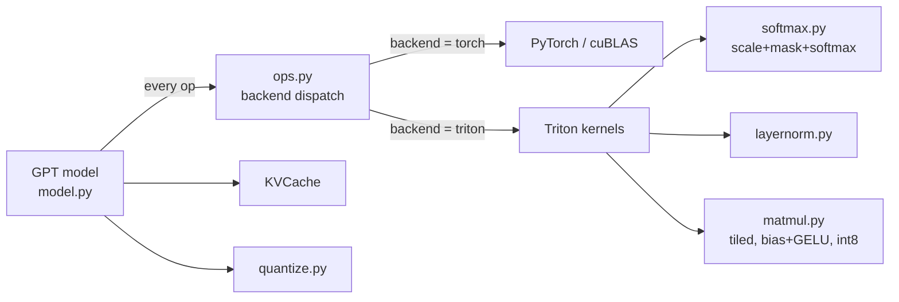

# KernelForge

[](https://github.com/Vanshika-Sharm4/kernelforge/actions)

**LLM inference bring-up and GPU kernel optimization.** KernelForge implements GPT-2 from scratch in PyTorch,
validates it against the Hugging Face reference, then replaces its hot operations with hand-written
[Triton](https://github.com/triton-lang/triton) kernels. It includes a benchmark suite, roofline analysis, and
profiling workflow to show *where* the time goes and *why* each optimization helps.

The project is organised around the loop performance engineers actually run:

> **bring up** a model → **verify** numerics → **profile** → find the **bottleneck** → write a **kernel** →
> **benchmark** against a strong baseline → explain the result with a **roofline** model.

## What's inside

| Area | What it does |
|---|---|
| **Model bring-up** | GPT-2 (124M) written from scratch, with a static KV cache. Loads Hugging Face weights; logits are checked against the reference. |
| **Fused softmax** | One Triton kernel does scale + causal mask + softmax in a single pass over the attention scores (works with the KV cache, where `T_q < T_k`). |
| **Fused LayerNorm** | Single-pass mean/variance/normalize/affine in float32 accumulation. |
| **Tiled matmul** | Tensor-core GEMM with tiling, grouped program ordering for L2 reuse, autotuning, and a fused bias + GELU epilogue. |
| **int8 weights (W8A16)** | Per-channel symmetric quantization and a matmul that dequantizes in registers, halving weight traffic in memory-bound decode. |
| **KV cache** | Prefill/decode split; compared against full recomputation. |
| **Benchmarks** | Kernel micro-benchmarks vs PyTorch/cuBLAS, end-to-end tokens/s, roofline plot, `torch.profiler` traces. |
| **Tests** | Every kernel checked against a PyTorch reference; KV-cache and backend equivalence; HF parity. |

## Architecture



Swapping backends is one line (`ops.set_backend("triton")`), so the same model code is the baseline *and* the optimized
version, and tests can assert they agree.

## Repository layout

```
kernelforge/
  model.py            GPT-2 from scratch, KV cache, HF weight loader, int8 conversion
  ops.py              backend dispatch (torch | triton)
  generate.py         greedy generation (with / without cache) + CLI
  quantize.py         per-channel int8 quantization
  kernels/
    softmax.py        fused scale + causal mask + softmax
    layernorm.py      fused LayerNorm
    matmul.py         tiled matmul, fused bias/GELU epilogue, int8 weights
benchmarks/
  bench_kernels.py    kernel micro-benchmarks vs PyTorch
  bench_model.py      end-to-end tokens/s (backend x batch x cache x int8)
  roofline.py         roofline plot
  profile_model.py    torch.profiler trace
  make_report.py      writes docs/RESULTS.md from the CSVs
  run_all.py          runs everything
tests/                kernel, model and HF-parity tests
docs/
  DESIGN.md           design notes and performance analysis
  INTERVIEW_PREP.md   how to explain this project
  RESULTS.md          generated by the benchmarks (after you run them)
```

## Quickstart

### On a free GPU (Google Colab or Kaggle, T4)

```bash
!git clone https://github.com/Vanshika-Sharm4/kernelforge.git
%cd kernelforge
!pip install -q -r requirements.txt
!pytest -q                      # correctness on the GPU
!pytest -q -m hf                # parity with Hugging Face GPT-2 (downloads weights)
!python -m kernelforge.generate --prompt "The key to fast LLM inference is" --backend triton
!python -m benchmarks.run_all --tag colab-t4
```

`run_all` writes CSVs, PNG plots and `docs/RESULTS.md` under `results/colab-t4/`. Commit them so the numbers in this
README are reproducible and checkable.

### On a machine without a GPU

The Triton kernels can be emulated on the CPU for correctness testing (slow, small shapes only):

```bash
pip install -r requirements.txt
TRITON_INTERPRET=1 pytest -q    # 32 tests; model tests run on the PyTorch backend even without TRITON_INTERPRET
```

Performance numbers require a real GPU.

## Usage

```python
import torch
from kernelforge import ops
from kernelforge.model import from_pretrained_gpt2
from kernelforge.generate import generate

ops.set_backend("triton")                                   # or "torch"
model = from_pretrained_gpt2("gpt2", device="cuda", dtype=torch.float16)
model.quantize_int8()                                       # optional: int8 weights for the block linears
out = generate(model, torch.tensor([[464, 3704]], device="cuda"), max_new_tokens=32, use_cache=True)
```

## Results

Run `python -m benchmarks.run_all --tag <your-tag>`; the measured tables are written to
[`docs/RESULTS.md`](docs/RESULTS.md) and the plots to `results/<tag>/`. Copy your headline numbers here:

| Benchmark (GPU: _fill in_) | PyTorch | KernelForge (Triton) | Speedup |
|---|---:|---:|---:|
| Fused scale + causal mask + softmax, T=1024 (GB/s) | _measure_ | _measure_ | _measure_ |
| Matmul + bias + GELU, GPT-2 MLP up-projection (TFLOPS) | _measure_ | _measure_ | _measure_ |
| int8 vs fp16 weights, decode matmul M=1 (GB/s effective) | _measure_ | _measure_ | _measure_ |
| End-to-end decode, batch 1 (tokens/s) | _measure_ | _measure_ | _measure_ |
| KV cache vs no cache, 128 new tokens (tokens/s) | _measure_ | _measure_ | _measure_ |

Report the numbers honestly. cuBLAS is extremely well tuned, so a hand-written matmul is often *not* faster for large
square GEMMs; the wins are in fusion (softmax, bias+GELU) and in memory-bound regimes (small-batch decode, int8
weights). Explaining why is more valuable than the speedup itself; see [`docs/DESIGN.md`](docs/DESIGN.md).

## Correctness and testing

* Each kernel is compared to a float32 PyTorch reference over awkward shapes (non-multiples of the tile size), with and
  without bias/GELU, with transposed weights (the tied LM head), and with `T_q < T_k` (KV-cache decode).
* The KV-cached forward pass must reproduce the full-sequence logits exactly.
* Generation with and without the cache must produce identical tokens.
* The Triton backend must match the PyTorch backend end-to-end (fp32 tolerance 2e-3; looser for fp16).
* `pytest -m hf` checks fp32 logits against Hugging Face GPT-2 (max abs diff < 1e-3) and fp16 top-1 agreement.

## Limitations

* Attention is only partly fused: scores are still materialised and the two attention matmuls use PyTorch. A
  FlashAttention-style kernel (online softmax, tiles of K/V in SRAM) is the natural next step.
* The PyTorch baseline for attention is a manual implementation, **not** `F.scaled_dot_product_attention` (which can use
  FlashAttention), so speedups are relative to that manual path. Add an SDPA baseline before making stronger claims.
* The softmax/LayerNorm kernels process one row per program, so rows must fit in one block (≤ 65536 elements).
* Inference only (no backward pass); greedy decoding; static-batch KV cache (no paging).
* int8 is weight-only (activations stay fp16); per-channel symmetric, no calibration or outlier handling.
* Tested on NVIDIA GPUs via Triton; not tuned for other accelerators.

## Roadmap

- [ ] FlashAttention-style fused attention kernel (online softmax)
- [ ] CUDA Graphs for the decode loop (remove kernel-launch overhead at batch 1)
- [ ] Larger models (GPT-2 medium/large) and fp8/int4 weights
- [ ] Paged KV cache and continuous batching
- [ ] Speculative decoding

## References

* Radford et al., *Language Models are Unsupervised Multitask Learners* (GPT-2), 2019
* Tillet et al., *Triton: an intermediate language and compiler for tiled neural network computations*, 2019
* Dao et al., *FlashAttention: Fast and Memory-Efficient Exact Attention with IO-Awareness*, 2022
* Williams et al., *Roofline: an insightful visual performance model for multicore architectures*, 2009
* Triton tutorials: fused softmax, layer norm, matrix multiplication

## License

MIT, see [LICENSE](LICENSE).
